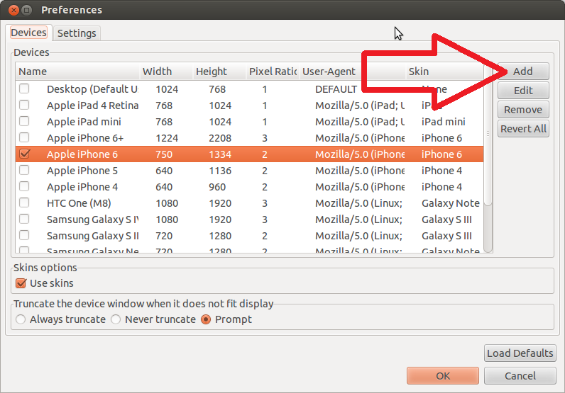
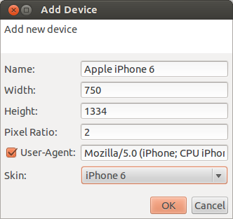

= How to add custom device to BrowserSim?
:page-layout: blog
:page-author: ibuziuk
:page-tags: [browsersim, cordovasim, jbosstools, devstudio]

Recently several people have asked me the following question: `How can I test Nexus 9 / Moto G / LG G3 etc. via BrowserSim? There is no such device in the preferences list.` Actually it's damn easy to do...

== Basic concepts
Firstly, I would like to introduce several fundamental concepts, which we will need in the further discussion (will try not to be tedious ;-)): 

* `Physical pixel` - the cell in the device's display matrix.
* `Display Resolution` - the number of distinct *physical* pixels in each dimension that can be displayed. For instance, resolution *1024 × 768* means that the width of the display is 1024 pixels and the height is 768.
* `Logical / Virtual pixel` - device independent pixel (dip). The abstraction allows an application to work in pixels as a measurement, while the underlying graphics system converts the abstract pixel measurements of the application into the *physial* pixel measurements appropriate to the particular device. A typical use is to allow mobile device software to scale the display of information and user interaction to different screen sizes.
* `Pixel Ratio` - the ratio between *logical* pixels and *physical* pixels.
* `User-Agent` - HTTP header that identifies the client software. When you open a web page, your web browser sends the user-agent to the server that hosts the website. This string essentially introduces your browser to the server, describing which browser version you are using and relating other information about your computer or mobile device, such as the operating system and it's version. The server can use this information to provide content that is tailored for your specific browser.

== How to add custom device?
Basically, it is extremely easy to do. Run BrowserSim, open preferences (*Right click -> Preferences...*) and push the *Add* button on the *Devices* tab :

The *Add Device* dialog will be shown:

Now all you need is to input correct data for your specific device and press the "OK" button - newly created device will be added to preferences. Let's practice on a real sample - http://www.microsoft.com/en-us/mobile/phone/lumia928/specifications/[Microsoft Lumia 928]. This phone has the following parameters:

* *Display Width*: 768
* *Dispaly Height*: 1280
* *Pixel Ratio*: 2.4 
* *User-Agent*: Mozilla/5.0 (compatible; MSIE 10.0; Windows Phone 8.0; Trident/6.0; IEMobile/10.0; ARM; Touch; NOKIA; Lumia 928)

NOTE: All device specific information can be easily found on the web

Unfortunatelly, there is no Microsoft Lumia skin yet, so you will have to select some other one. Of course this doesn't make the experience smooth and complete but you will be able to archive the main aim: test and reproduce layout issues for that device. Although we are trying to update the list of skin / devices, we won't be able to cover every single case anyway. So, from time to time you will need to do it manually. In the brand new `http://tools.jboss.org/downloads/devstudio/luna/8.0.1.GA.html[8.0.1.GA]` release we have added `IPhone 6 / 6 plus` devices: 

== BrowserSim standalone
For one who doesn't use Eclipse / JBoss Developer Studio there is a standalone mode of BrowserSim. More details about BrowserSim standalone can be found in the following http://tools.jboss.org/blog/2014-10-30-standalone-browsersim-is-back.html[blog].
   
== Conclusion
We are trying our best to make our tools as good as possible. User feedback is what we are seeking for now. We look forward to hearing your comments, remarks and proposals. +
Merry Xmas and Happy New Year! +
Have fun!

Ilya Buziuk +
https://twitter.com/ilyabuziuk[@ilyabuziuk]
